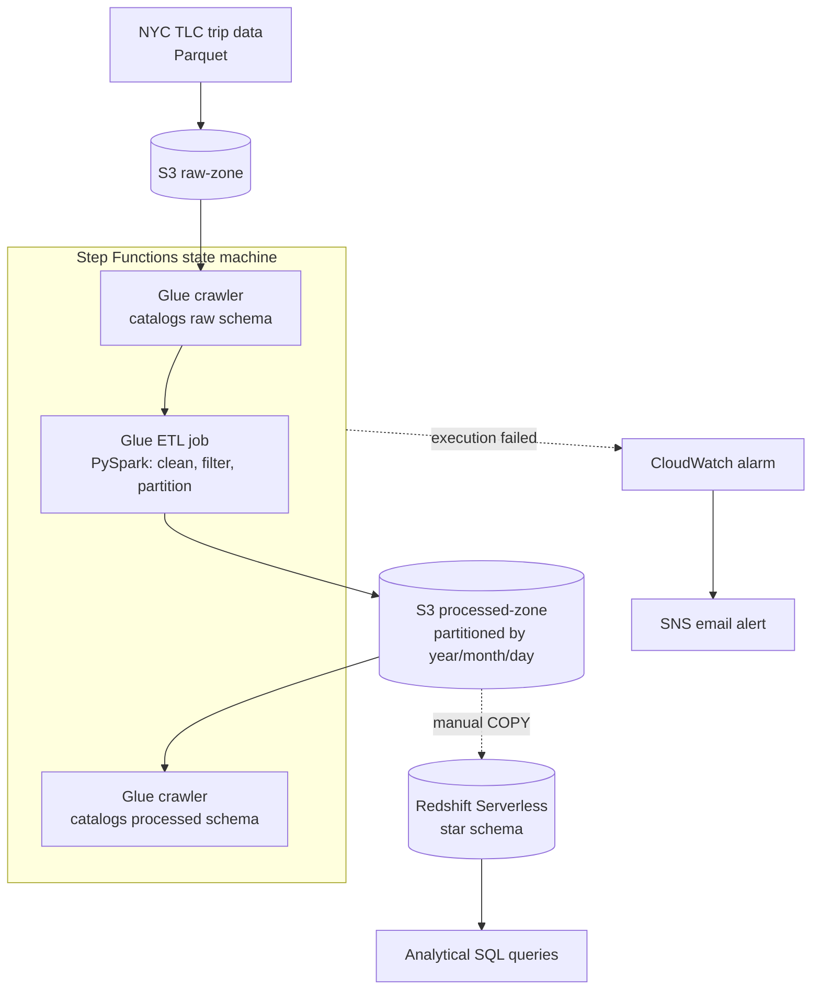
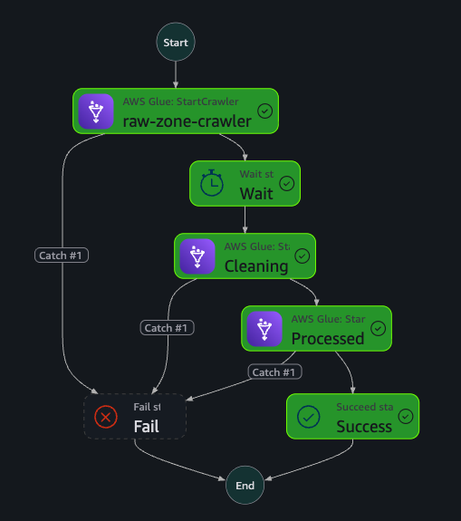
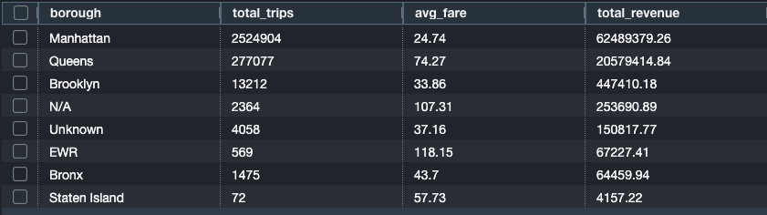
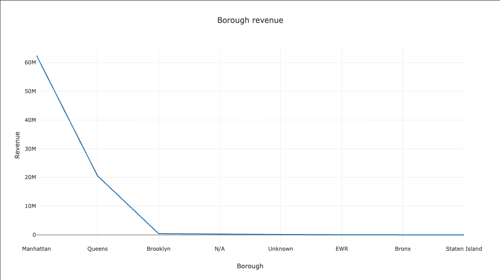
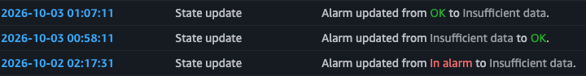

# NYC Taxi Data Pipeline

A batch pipeline that ingests NYC TLC taxi trip data, cleans and partitions it with AWS Glue (PySpark), and loads it into a Redshift star schema. Step Functions orchestrates the ingestion and transformation stages, with CloudWatch and SNS alerting on failures.

Built as a hands-on project while studying for the AWS Certified Data Engineer - Associate (DEA-C01) exam.

## Problem

Raw taxi trip data (3.8M rows for one month) has to go from a single messy source file to a queryable, analytics-ready warehouse. The file has the data quality problems real pipelines hit: nullable fields, a dead column, and corrupted timestamps. A "June 2026" extract contained trips dated as far back as 2008.

## Architecture





**Why this stack:**

- **Two S3 zones (raw and processed).** Raw data stays untouched as a rebuild source. Processed data is partitioned for efficient queries.
- **Glue (managed Spark) instead of a local script.** It scales past one machine's memory and needs no cluster management. It fits a straightforward batch ETL better than managing an EMR cluster.
- **Redshift instead of querying S3 directly.** A warehouse suits repeated analytical queries (joins across dimensions, aggregations). Athena was still useful for quick validation of the processed data through the Glue Data Catalog.
- **Star schema.** `fact_trips` holds the measurable values, and `dim_date`, `dim_location` and `dim_vendor` hold descriptive context. This avoids repeating text across millions of rows and keeps aggregations to a join plus a group-by.
- **Step Functions instead of manual triggering.** The crawler, job and second crawler run as one coordinated flow, with failures routed to a Fail state.

## Data quality handling

- Dropped `request_source`, which was entirely null.
- Dropped rows missing `passenger_count` or `RatecodeID`.
- Cast `store_and_fwd_flag` from a Y/N string to boolean.
- **Filtered out-of-range timestamps** (`pickup >= '2026-06-01' AND pickup < '2026-07-01'`). The partition listing showed 36 partitions instead of the expected 30, including a `year=2008` partition. Profiling the output exposed the corrupted timestamps, and the filter removed them.

## Schema design

`fact_trips` uses `pickup_date_id` as both `DISTKEY` and `SORTKEY`, since most analytical queries filter or group by date. `dim_location` is loaded from TLC's taxi zone lookup table, `dim_vendor` from TLC's data dictionary, and `dim_date` is generated for June 1-30, 2026.

## Results

Trips and revenue by pickup borough (June 2026):

| Borough | Trips | Avg fare | Total revenue |
|---|---|---|---|
| Manhattan | 2,524,904 | $24.74 | $62,489,379 |
| Queens | 277,077 | $74.27 | $20,579,415 |
| Brooklyn | 13,212 | $33.86 | $447,410 |
| N/A | 2,364 | $107.31 | $253,691 |
| Unknown | 4,058 | $37.16 | $150,818 |
| EWR | 569 | $118.15 | $67,227 |
| Bronx | 1,475 | $43.70 | $64,460 |
| Staten Island | 72 | $57.73 | $4,157 |

Queens' high average fare likely reflects airport trips (JFK, LaGuardia), and EWR is the highest, as expected for long rides to Newark. `N/A` and `Unknown` are TLC's own zone IDs for trips with no valid GPS zone, so they are kept.




## Debugging notes

These are the issues I hit and fixed during the build:

- **IAM, in three places.** The Glue role was read-only and hit a `403` writing to `processed-zone`. Redshift's `COPY` role couldn't list `raw-zone`. The Step Functions role generated by the visual designer covered only Glue job runs, with no `StartCrawler` permission, and later needed CloudWatch log-delivery permissions. Each was fixed with a scoped inline policy.
- **Two stacked Step Functions errors.** The first failure was `AccessDenied` on `StartCrawler`. After granting the permission, the next error was `EntityNotFound` for a crawler named `MyData`, a placeholder from the visual designer that I never replaced. Fixing one error exposed the other.
- **Redshift `COPY` and Parquet.** Redshift matches Parquet columns by name, not by position. A staging table built with `LIKE` didn't line up with the file's columns (`PULocationID`, `tpep_pickup_datetime`), and the load failed with a `NOT NULL` error. I rebuilt it with names matching the file exactly.
- **Parquet type mismatch.** Spark wrote `passenger_count` and `payment_type` as `bigint` and fares as `double`. The load failed with a Spectrum scan schema error until the staging table's types matched what Athena reported for the catalogued table.
- **Stale catalog partitions.** After the date filter removed the bad partitions from S3, the Glue Data Catalog kept listing them. Deleting the table and recrawling fixed it.
- **Resources in the wrong region.** The Glue job and crawler had been created in `us-east-1` while the buckets were in `us-east-2`. I recreated them in `us-east-2` so everything lined up.
- **Redshift SQL limitation.** `generate_series` isn't supported for inserting into a user table, so `dim_date` is built with a `UNION ALL` of 30 dates.
- **CloudWatch alarm.** The first alarm, using the `Average` statistic, never entered the alarm state on a deliberately failed execution. After switching to `Sum` (the usual statistic for count metrics like `ExecutionsFailed`) and re-testing, it fired and the SNS email arrived.



## Known limitations

- **The Redshift load is a manual step.** Step Functions automates ingestion through transformation (crawler, Glue job, crawler). The `COPY` into Redshift runs by hand in Query Editor v2. The next step would be adding Redshift Data API states to the state machine.
- **Reruns of the fact load append.** `load_fact_trips.sql` inserts without clearing the table, so running it twice duplicates rows. An automated version needs a `TRUNCATE` or a partition-aware load.
- **Null handling drops rows.** The null and date filters together removed roughly 1M of the 3.8M raw rows (about 26%). Imputing `passenger_count` and `RatecodeID` instead of dropping would keep more data, at the cost of inventing values.
- **Fixed wait instead of polling.** The state machine waits 60 seconds after starting the crawler instead of polling until it reports `READY`.
- **Single month of data.** The date filter and `dim_date` are hardcoded to June 2026.

## Running it

1. Create the two S3 buckets and upload the TLC trip file to the raw bucket and the zone lookup CSV under `lookup/`.
2. Create the two Glue crawlers (raw and processed) and the Glue job from `glue-scripts/cleaning.py`, each with a scoped IAM role.
3. Create the state machine from `step-functions/state_machine.json` and run it.
4. Create a Redshift Serverless workgroup with a daily usage limit, then run the SQL files in `redshift/` in order: `create_tables.sql`, `load_dimensions.sql`, `load_fact_trips.sql`.
5. Run the queries in `redshift/analytical_queries.sql`.

Set an AWS Budgets alert before starting. Redshift is the first service that adds real cost.

## Stack

- **Storage:** S3
- **Transformation:** AWS Glue (PySpark)
- **Warehouse:** Amazon Redshift Serverless
- **Orchestration:** AWS Step Functions
- **Monitoring:** CloudWatch alarm and SNS

## Repo structure

```
glue-scripts/
  cleaning.py              Glue ETL job: clean, filter, partition
redshift/
  create_tables.sql        star schema DDL
  load_dimensions.sql      dim_date / dim_location / dim_vendor loads
  load_fact_trips.sql      staging table and fact_trips load
  analytical_queries.sql   sample analytical queries
step-functions/
  state_machine.json       orchestration definition
docs/images/               screenshots used in this README
```
